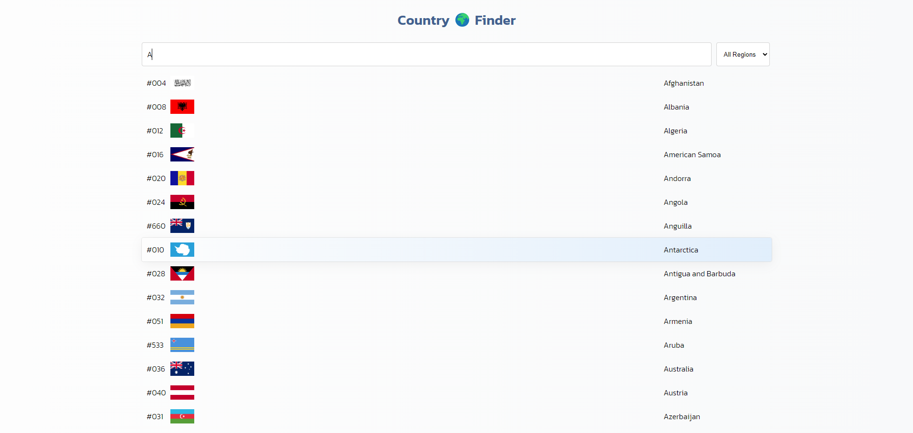

# Country 🌍 Finder

## Introduction

Country Finder is a Next.js project that allows users to search for countries based on their names and regions. The application provides a user-friendly interface with features like live search, region sorting, and a visually appealing design.

## Prerequisites

Make sure you have [npm](https://www.npmjs.com/) installed.

## Installation

To get started, follow these steps:

1.  Clone the repository:

    bashCopy code

    `git clone https://github.com/Bar-Barina/country-finder.git`

2.  Navigate to the project directory:

    bashCopy code

    `cd country-finder`

3.  Install the dependencies:

    bashCopy code

    `npm install`

## Usage

To run the development server, use the following command:

bashCopy code

`npm run dev`

Once the development server is running, open your browser and go to http://localhost:3000 to access the Country Finder application.

## Features

- **Live Search:** Quickly find countries by typing in their names.
- **Region Sorting:** Sort countries based on their regions.
- **Error Handling:** Informative messages for users in case of data fetching errors.

## How to Use

1.  Enter the name of the country you want to search for in the search bar.
2.  Optionally, use the region sorting feature to narrow down the search.
3.  Explore the list of countries that match your search criteria.

## Contributing

Contributions are welcome! If you encounter any issues or have suggestions for improvement, please open an issue or create a pull request.

## Acknowledgments

- **API Service:** Utilizes the apiService for fetching country data.
- **Utility Service:** Uses the utilService for debouncing search queries.
- **Components:** Various React components are used for creating a modular and maintainable structure.

Feel free to explore and enhance the project as needed. Happy coding!
